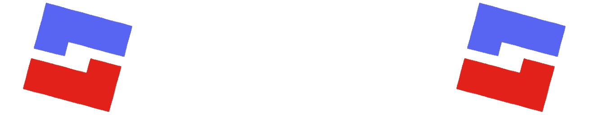

<div align="center">

   

   <a href="https://rcord.rbxgarand.xyz" rel="noopener noreferrer" target="_blank"></a>
   
   <a href="https://wally.run/package/garanddev/rcord" rel="noopener noreferrer" target="_blank"></a>
   
   <a href="https://github.com/garanddev/rcord" rel="noopener noreferrer" target="_blank"></a>

   Allows for Webhooks in Roblox via **rCord**
   - - -
</div>

<div align="center">

   [](https://github.com/GarandDev/rcord/releases/latest)
   [](https://github.com/GarandDev/rcord/graphs/contributors)
   [](https://github.com/GarandDev/rcord/issues)
   [](https://github.com/GarandDev/rcord/pulls)
</div>

rCord allows you to easily deploy webhooks in your game, allowing you to have a better view of your game.
- Full type support via both LuaU Language Server and native Roblox. 📱
- Read our new [documentation page](https://rcord.rbxgarand.xyz) where you can learn about all the workings of rCord 📝
- Compact and lightweight, allowing for fast deployment. 🤏
- Fast and without proxy, no worrying about proxy downtime. ️💨
- Easy syntax inspired by [discord.js](https://discord.js.org). 👍
- - -

<h3>Example usage</h3>

```lua
local Players = game:GetService("Players")

local rCord = require(script.Parent.rCord) -- Adjust this path as needed
local webhook = rCord.createWebhook("https://discord.com/api/webhooks/.../...")

Players.PlayerAdded:Connect(function(player)
   webhook:send("Player " .. player.Name.. " joined!")
end)
```